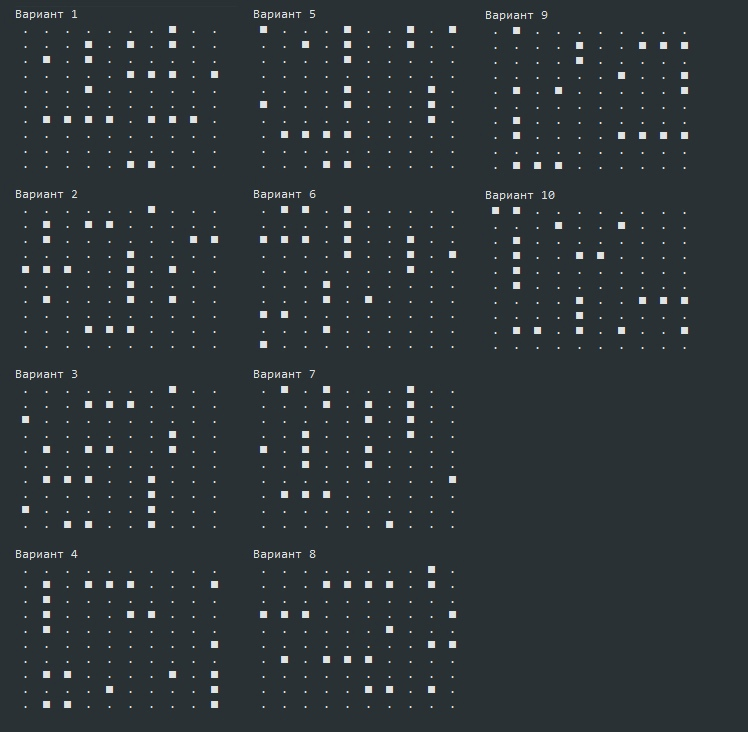
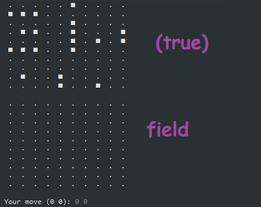

# Console Sea Battle


В книге *"HeadFirst - Изучаем Java"* на первых главах нам предлагают написать простое консольное приложение ***"DotCom"***, но мне совершенно не нравится логика, предлагаемая нам в книге.  

Отсюда мне пришла идея реализовать полноценную логику расставления кораблей компьютером по классическим правилам игры *"Морской бой"*.

---
- Так выглядит 10 произвольных вариантов генерации кораблей компьютером:



Запуск программы производится в классе **com.eleonoralion.ConsoleSeaBattle.Main**

```
public class Main {
    public static void main(String[] args) {
        Game game = new Game(true);
        game.start();
    }
}
```

Параметр **_true_**, передаваемый в качестве аргумента конструктору класса **Game**, сообщает программе отрисовать в начале игры нам скрытое поле противника с расставленными кораблями, чтобы убедиться, что всё работает верно. 



Ход (Input) производится в формате '**0 0**' (ЧислоПробелЧисло).

В данном алгоритме реализовано:

- Генереция кораблей компьютером
- Ход пользователя
- "Раненные" корабли
- Отрисовка точек вокруг мёртвого корабля 
- Проверка уже использованных ячеек
- Конец игры
